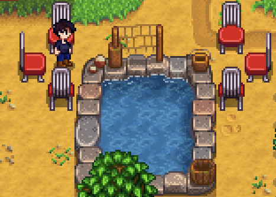

# Fish Pond Fishing
This glitch enables adding fish to the fishing collection via fishing in the fish pond.
## How to perform
If you fish at the very top of a fish pond, it is possible that when you click during the ! ring rather than getting the normal instant pull out, you can get the entire fishing minigame.

To maximize consistency, place a chair facing the top row of the pond. Any of the 6 chair positions shown in this image function for this.

Get in and out of the chair, setting your y-position to a predictable value. Walk purely horizontally from now on, and start fishing into the pond. Zoom in to get a good glimpse of what is occuring, and catch fish. You will succeed whenever the bobber has (on net) moved up from the starting position, so you want to keep an eye on that. Once a fish has been successfully caught, you can empty the pond and switch to the next.

## Additional Details
Fish are added to your collection the moment you start holding the fish above your head. Animation canceling at that point will keep the collection, but stop the fish from entering your inventory. This also avoids incrementing PreciseFishCaught (which matters for Jelly rng), or using up bait or tackle durability. 

The bobber moves up and down on a global pi/2 second (approximately 1.57) sinusodal cycle. The setup ensures that the bobber begins at the very highest starting point, where if it gets literally any higher the trick will work. This means that if you were to click randomly, there would be about a 50% chance of success. Because the ! lasts for 0.8 seconds, assuming a random starting time and a perfectly timed click, there is a 75% chance of success. However, if you can ensure a consistent starting time modulo 1.57 seconds, you can near a 100% success chance. That isn't actually practical, but it means that if you can get into a rhythm you can experience large streaks of success. Furthermore, it is theoretically possible to know to exit early if you notice that the bobber begins anywhere between "moving up mid-speed and accelerating down" to "moving down mid-speed and accelerating down".

This cyclical behavior also means that you can get into a grove of failure; a quick "throw fish back in" loop can be almost exactly 1.5 seconds long, so in such a situation you should take a half a second breather.

If you click when there is no !, you will reel in your fish if your bobber was currently in a position to fail the glitch, or reel in nothing if it was in a position to fail the glitch. This lets you know if you would have succeeded, though of course it doesn't actually help with success.

The crab pot fish do not have a fishing minigame, but can still be caught via this. It's risky to animation cancel them, so it's recommended to just let them into your inventory and listen for the first catch jingle (or see the first catch text above the white text box). Unfortunately, algae and jellies can't be placed in the ponds, so you can't do those.

## Code Explanation

While a bobber is flying over the water (in `FishingRod.tickUpdate()`, the game checks if the current tile is fishable. If it isn't, it checks the squares perpendicular to the casting direction, and if those are fishable, it starts moving the bobber 4 pixels at a time (64 pixels to a tile) towards that tile. This means that in our horizontal throw, when we throw from above the fish pond it will move by some multiple of 4 down into the pond. That means that our bobber could land in 4 possible positions, which is why using the chair to ensure the best one is so important; while a perfectly timed click from the best position can succeed in 75% of cases, a perfectly timed click from the worst position can only succeed in less than 25% of cases. As this is substantially more precise than you can see via player movement (and cardinal movement moves by a multiple of 4 anyway, meaning subpixel alignment is an issue that hurts us), you can't consistently get into the position normally. 

Once the bobber is in the water, every frame it moves by `0.12 * sin(Game1.currentGameTime.TotalGameTime.TotalMilliseconds.TotalMilliseconds/250)`. This movement is unconditional, and not purely visual. This means that from our starting position at the top of a tile, it can move in and out of the tile. 

When you reel in, the game calculates what tile you were fishing in via taking `FishingRod.calculateBobberTile`, which divides the position by 64, and then casting to integer, which truncates the decimal. It uses this truncated tile value to check via `GameLocation.isTileBuildingFishable` (which uses `FishPond.isTileFishable`), and can see that it isn't. Thus, it uses `GameLocation.getFish` and passes in the non-truncated bobberTile. In `GameLocation.getFish`, however, it does not truncate the value when calling `FishPond.isTileFishable`, and because the game uses a strict comparison the truncated value failed due to being equal to the top of fish pond, and this one succeeds due to being (untruncated) inside the fish pond.

## Video Explanation
[I have made a video to explain the fish pond glitch to somebody before, but ](https://www.youtube.com/watch?v=pFt4zuNpmXI)