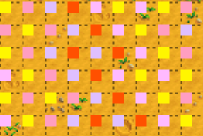
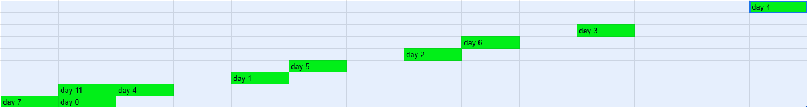

## What is it:
Crop manipulation is a strategy where you plant and harvest crops in a specific way in order to primarily influence their quality. There are some simpler methods for this, and more advanced ones but it works on all versions of the game. This works because crop quality is (typically) determined by the day, the game seed, and the coordinates of the tile that the crop is on. For normal crops, the random object that determines this is seeded with `xTile * 7 + yTile * 11 + daysPlayed + gameSeed` in versions prior to 1.6, and in 1.6 `Utility.CreateRandom((double)xTile * 7.0, (double)yTile * 11.0, Game1.stats.DaysPlayed, Game1.uniqueIDForThisGame)`, which if you have legacy randomisation on, translates to the same as prior to 1.6, and without legacy randomisation it progresses non linearly. For "forage crops" aka forage you pick up off the ground, the random object is seeded by `daysPlayed + gameSeed/2 + xTile * 1000 + yTile * 2000` prior to 1.6, note that division with `/` is always rounding down to the integer below. In 1.6, the random object is created by `Utility.CreateDaySaveRandom(xTile * 1000, yTile * 2000)` which behaves the same as in the case for normal crops. There is an edge case of when forage crops are grown by a fairy, and harvested the day after, where they actually use the normal crop random for quality determination. (confirm if works in 1.6) This is focusing on unseeded crop manipulation, since if you know your seed, you can use [BlaDe's predictor](https://www.nexusmods.com/stardewvalley/mods/6614). If you are on 1.6 and not using legacy randomisation, the only method which will work for crop manipulation are the first two below.

### "Lazy" crop manipulation:
1. Harvest your whole field of crops, eg say you are looking for only gold quality, note where it was, and reset the day. If you did not get one, you can try the next day, or depending on if your farming level increased during the harvesting, in which case you can also try to harvest them in a different order(since having a higher farming level makes better quality more likely). If you already have one crop of whatever desired quality, you can skip this step.
2. Each day, fill up every empty spot in your inventory with something you will not be harvesting, and 1 spot with your desired crop quality, attempt to click every crop, and you will only harvest the ones of your desired quality.
3. Repeat until you have enough crops of desired quality.

Notes:
- This also works on harvesting forage, you can only pick up an item if you have space for it in your inventory, including accounting for its quality. There is an exception to this, which is spring onions on patches before version 1.4, where you could instead spam click to try and harvest them until it gave you your desired quality. 

### Flower colour manipulation:
Flower quality manipuluation is controlling what colour flowers grow up to be. Unlike most things, this is not seed dependent, but only dependent on tile position and day of month the seed is planted. The easiest way to do this is utilising BlaDe's predictor, however on legacy randomisation or before 1.6, there is a set pattern to it, which moves up 1 tile vertically daily and has the pattern as in the image below. This is the pattern for poppies, but all the flowers are approximately alternative in vetical rows while the random numbers shift, changing it over time, and a horisontal row tends to iterate through each colour individually. 

Usage examples:
- This can be used in penny marriage with some manip routes, since if you cannot open your inventory and are downpatched to 1.5 or earlier(so called "inventory manip", which prevents you from meeting robin and lewis to control board quests), having only 1 or 2 colours minimises inventory management.(add link to a route that does this maybe?)  

### Real crop manip
For speedrunning purposes, this will be primarily focusing on manipulating for gold quality crops, assuming no use of deluxe fertiliser.\
The short version of how it works is when the RNG seeding is linear, on observing prior gold quality crops, you can infer the location of other ones via knowing the difference in RNG seed, and the numbers involved in the RNG use.\
\
More specifically, the process is as follows:
1. We have an initial gold crop observation. For demonstation purposes, lets assume it is a gold crop found at level 0 farming on day 0. This means that it has an RNG number somewhere in the range 0-0.01, and will be used later.
2. Each day, due to the RNG seed, this exact gold spot moves (3,-2), that is right 2, up 1, so if on day 0 it is at coordinates (1,0), on day 1 it is at coordinates (4,-2), and on day 2 it is at (7,-4) etc. This pattern looks like the picture below:

Due to the fact that we are on a fixed file(so fixed game seed),we know how daysPlayed progression(each day it increases by 1), the only factors we care about and can control are the relative tile location on a given day. If we look at the relevent bit of the RNG seeding `xTile * 7 + yTile * 11 + daysPlayed`, we can see that if we increase `xTile` by 11(right), and decrease `yTile` by 7, there is no difference in the RNG seeding, and thus it is the same position, hence why there are 2 day 4 positions marked. This just lets us wrap the pattern neater together. We can also see from this that if we decrease `xTile` by 1, and increase `daysPlayed` by 7, the pattern just shifts 1 tile left, likewise if we decrease `yTile` by 11, and increase `daysPlayed` by 11, the entire pattern has shifted up 1 tile. These are respectively shown by the day 7 and day 11 spots on the image.
3. In reality, you want more than 1 new crop per day in a close area, since going out to harvest many days, or walking a long distance to harvest many days is timeloss, and in a speedrun, timeloss is bad.
So for a fixed day(since we reliably know how a given RNG spot moves over time), we want to know the difference in RNG values between the spot we **know**, which in our current case is 0-0.01(we will call this spot A), and all the other nearby spots, since if there is a small difference in RNG value between spot A and spot B, it is also likely or garenteed to also be a gold quality crop. We know how this works since the C# random object is very known, and so we know the magic numbers for all of the random calls, since the rng values are all decided ultimutely by something of the form `a * randomSeed + b % 1`, where `a`,`b` are both some long decimal values, and `randomSeed` is an integer, and then we take the remainder(modular arthimetic, its all modular arthimetic). For gold quality manip for us, since we are only ever dealing with differences in RNG, this formula cancels out to `a * (randomSeedB - randomSeedA) % 1`, and the for the 1st random call(which is the main one we will always be dealing with) `a = 0.5224253142` approximetly.
4. In our example situation, spot A was found at farming level 0, so spot A has an rng value somewhere in 0-0.01(1% is the chance of gold crop with no fertilliser at farming level 0). Lets say we are now farming level 1, and we can use basic fertilliser, giving us a RNG range for gold crops of 0-0.08. This means that if the difference in RNG values between spot B and spot A is in 0-0.07, spot B will also always be a gold crop. (We got this number by subtracting the possible ranges, so `0 - 0 = 0` for the lower bound, and `0.08 - 0.01 = 0.07` for the upper bound, if the RNG value difference was in 0.07-0.08, it would be a gamble depending on what exactly the initial value was if spot B is gold quality or not, and we dont like that). The exact rules for determining what the safe RNG difference range is depends on how you observed the initial gold crop, and what you are working with for future crop asumptions. 
5. For example in our case, it happens that an RNG seed difference of 2 results in an RNG value of `2 * 0.5224253142 % 1 = 0.04485062838`, which is within our 0-0.07 range, but if we had instead not used basic fertilliser, reducing the valid range for spot B to 0-0.03 and the safe difference range to 0-0.02, it is not in that range, and would(garenteed) not be an additional gold quality crop. 
6. Raw RNG values and seed differences are not particularly helpful to work with however, since we can only work by translating this into relative tile placements. The way we do this is by finding integer solutions to `xDiff * 7 + yDiff * 11 = SEED_DIFFERENCE`, which in this case is `xDiff * 7 + yDiff * 11 = 2`, and right is the postive X direction, and down is the positive Y direction. You can do this manually, or you can just find an online tool to do this for you, for example [Wolfram Alpha](https://www.wolframalpha.com/) which will just tell you a general solution. Note that Wolfram Alpha does not like variables like `xDiff` and will not neccicierly work, however if you put it as `7*x + 11*y = 2` it will work. This gives a solution of `x=11*n+5`,`y=7*n-3`, where `n` is just whatever integer you want, however in 99.9% of cases, you are using `n=0` so can read of a solution of `(x,y)=(5,-3)`, so 5 tiles right, and 3 tiles up from spot A. This gets tedious to do after a while, so there is a list of the convinient values for this in a table below with their associated RNG values and seed differences which is sufficient for most basic crop manipulation purposes, as well as a reference with the safe RNG ranges in different cases.[add these lol, probably also some visual things idk]

Notes:[expand this]
- other things of note that also use a similar RNG(eg quests on 1.5)
- silver quality crops are different and use 2nd rng call
- iridium fertilliser makes a difference too as adds an rng call for iridium before the gold check, so iridium is the 1st call, and gold is the 2nd call, and silver is the 3rd call.
