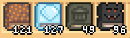
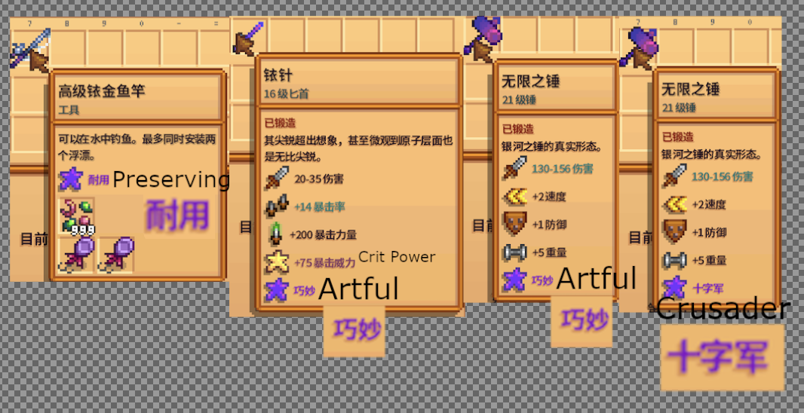

# Paste

The paste can be found unformatted at [this link](/routes/Pastes/GlitchedTruePerfUnformatted2026v2.txt), and can be found formatted at [this link](/routes/Pastes/GlitchedTruePerf2026v2.md).

# Route
## Overview
The main mechanic is to repeatedly read the mail to get different effects applied, each of which help towards specific aspects of perfection. The main limiters are Fishing, Eradication, and Friendship. Note that you never need to worry about garbage items entering the inventory, as they will all be cleared upon the next read.

## File Creation
You need to be in Chinese, select Meadowlands Farm, Legacy RNG, and Female character. Copy paste the name into the player's name, and use whatever you want for farm name / favorite. Don't skip the intro cutscene, and watch it until Robin first says the player's name (at which point you skip)
## Day 1
If you wish, you can exit to menu and switch to English and then load back in. Drink the Triple Shot and eat the Magic Rock Candy on your way out the door. Move the bed closer to the door as you do, to make future sleeping faster. Immidiately read your first mail.
### Read 1
This read empties your inventory of tools and gives the following items:

- A Return Scepter, to warp back to the farm after visiting The Sewers
- 999 Mega Bombs, both to use immidiately to bomb the area around the farmhouse to give space for buildings later, and as a dummy item.
- An Iridium Spur, to equip for combat use later.
- 60 Book of the Stars, to read as you run to reach level 10 in all skills
- 999 Undo-Buttons, an item that can be used to repeat previous steps in the paste in case of accidents
- A Junimo Chest, to place these Undo-Buttons in (as they execute whenever they're in the inventory)
- A Beach Warp totem, to warp to after talking to Pierre.
- Cat Ears, my personal choice for a for-fun cosmetic. Feel free to replace with your preference

Place the Junimo Chest with the Undo's inside of them, and bomb the front yard as you run out. Read all the books, and head to Pierre. Buy 2 backpack upgrades, gift Pierre a Mega Bomb (it is important to gift him an item rather than to speak to him), and warp to the Beach.

Run to Marnie, and buy a chicken named the Chicken section of the paste. This leaves you with a return scepter, 35 items for the shipping collection, and warps you to a sewers cutscene. Watch until the first text box shows up, and skip. Talk to Krobus, and warp home.

### "Read 2"
Don't read your mailbox upon going home, as it's already filled with the first set of shipping collection. Sell them.
### Read 3-5
Only shipping, sell.
### Read 6
This inventory (starting with Moss and having a big chest and a workbench at the end of the inventory) is a mix of shipping collection and crafting. The first 10 items are to be sold, and then you place the big chest and the workbench next to it and then fill up the big chest with the rest of the inventory.
### Read 7
This inventory is purely for crafting, place all of it in the big chest.
### Read 8
The first item is a cookout kit - place it. Otherwise, you now have every item required for crafting. Open up the workbench, and craft every single item. It is *highly* recommended to have quick access to something bound to delete; an animation cancel key works, or just the actual key if convenient.
### Read 9
Contains the items required to cook the first 2 rows of recipes. Cook them all.
### Read 10
Contains all the items for the next 2 rows, as well as all but the last item on the first row of the next page.
### Read 11
Avoid cooking the Miner's Treat twice, and finish off that row, the next row, and 8/10 of the third row.
### Read 12
Cook all remaining recipes. Then, place down the Mini-Forge and combine + equip the rings. If desired enchant the rod, but it's likely not worth it.

### Read 13
This read will fill up your inventory for various tasks. These are:
- Use the Beach warp totem and immidiately run left to the Wizard (note: it might be slightly faster to buy a chicken called `#$v 112 false `).
- Gift the wizard 4 Stardrop Teas (do not talk).
- Construct every obelisk (ensuring that they're all reachable) and the Golden Clock.
- Run to the wizard's trapdoor, step on the warp to Witch's Hut, and use the hammer special to kill the doved kids to complete the Bat eradication goal. Drop all the items you pick up (due to the diversity in items they could drop, these are not removed on mail read unlike other common trash items.)
- Island warp and run to Leo's house, skipping the cutscene (which counts as meeting).
- Mountain warp and run to Robin's house, and order a Fish Pond.
- Warp home and go to sleep. In the upgrade menu select every Right option for level 5, and Left options for level 10 (to get Acrobat).
## Day 2
Immidiately sleep.
## Day 3
Run outside as you consume Seafoam Pudding (optional). 
### Read 14
Read the mail. The inventory will now fill up with fish. Perform the Fish Pond fishing glitch.

Place the chair in your inventory next to the fish pond; have it face up and one tile below the top. Get in and out of the chair, and now don't move up or down again. Move sideways to the pond, and start doing minimum distance fishing. Note the bobbing up and down, as that is what makes the glitch possible. When the bobber is high up, and you have a ! going, pull in the fish and you should get a minigame. If pressed without a !, you'll either pull up nothing (which indicates correct positioning of the bobber) or the fish, at which point you throw it back in. Once the fish has been successfully caught, press the empty pond button to allow throwing in a second fish, and repeat. The bobber movement is on a π/2 second cycle, and this positioning approximately maximizes the portion of the cycle that works.

You may animation cancel when the fish is caught (held above the head) to avoid it going back into the inventory. Currently excess fish are removed on reads, but that might get phased out.

Catch every fish in your inventory.
### Read 15
Read the mail to get a second inventory. Catch all of these too.
### Read 16
Read the mail for a third time, and get the final inventory for the run. Your inventory should now be
- Advanced Iridium Rod, for the remaining green/white algae and jellies.
- Training Rod, for seaweed in summer.
- Seafoam Pudding, for above.
- Dressed Spinners, for the rod.
- Deluxe Bait, for the rod. Notably, spinners/bait don't make fish in a fish pond bite any faster so they would have been useless earlier.
- Various resources to use in the Mini-Forge

- Iridium Pickaxe, in case there's rocks in the way. 
- Staircases, to allow quick access to SC floor 7, Dangerous Mines 49, and Dangerous Mines 96.
- Watering Can. Use Prismatic Shards to get Bottomless, for use in the Volcano (you can tell bottomless by purple preview).
- Infinity Gavel. Use Rubies for extra damage, and then use Prismatic Shards to get Artful. This is for general-purpose use.
- Iridium Needle. Use Dragon Teeth to enchant it with +75 crit power, and then Aquamarines to max crit chance. Use Prismatic Shards to get Artful. This is for use on Magma Sprites and Royal Serpents.
- Triple Shot Expresso and Magic Rock Candy, as speed buffs.
- Mega Bombs, because it's faster to use them than weapons.

- Return Scepter, to return home.
- Triple Shot Expresso and Magic Rock Candy, as speed buffs.
- Jewels of the Sea. When read, the next time you read the mail floor 1 of the Skull Caverns will become infested.
- The Diamond Hunter. When read, the next time you read the mail floor 7 of the Skull Caverns will become infested.
- The Alleyway Buffet. When read, the next time you read the mail floor 49 of the Dangerous Mines will become infested.
- Monster Compendium. When read, the next time you read the mail floor 96 of the Dangerous Mines will become infested.

At this point, it is time to work on Monster Eradication. Use the Island Obelisk and run to the Volcano, and kill as many Magma Sprites as you can.
## Days 4+
Repeatedly kill Magma Sprites. It remains untimed as for whether warping home to sleep (and reading the mail daily) is faster than using a Tent Kit and Monster Musk outside the Volcano, but the name is set up for warping home each night. Continue until the Magma Sprites are entirely eradicated.
## Day 13
Spend some of the morning working on fishing the remaining fish (Green/White Algae, Cave/River Jelly). When you read your mail, the next fish you catch has significantly increased chances of being a Cave/River/Sea Jelly. Eradicate Duggies on floor 15 and Skeletons on floors 70-79. Note that you need to read your mail 3 times in the morning to unlock floors in the mines (byproduct of ensuring difficulty +2). Then, go to the festival.

At the festival, say hi to every NPC (you've already met Pierre), and then leave. You will get the quest-complete notification.
## Day 14
Sleep.
## Days 15+
Start working on the other eradication goals, and use the Desert Festival Chef (recommended meal is Extremely Sharp Cheddar and Uncomfortably Hot Sauce, for +3 attack and +1 speed. This is 4th and Bottom). Speak to Sandy at some point. Recommended order is Dino->Regular Mines->Skull Caverns, but it's generally marginal.
### Slimes
Read Jewels of the Sea to make floor 1 of the SC infested, and kill slimes there. It's likely they will be eradicated before serpents.
### Serpents
Read Jewels of the Sea to make floor 1 of the SC infested. If it's a slime-only floor, warp home and read it again to reroll. 
### Mummies
When Floor 1 is a mummy floor, and a high density of mummies is observed, kill them with bombs. You can also kill them on the way to floor 7 for dinosaurs.
### Dinosaurs
Read The Diamond Hunter to make floor 7 of the SC infested. Ladder down to it, and observe if it is a dinosaur floor. If it is a slime/regular infested, warp home and reroll. If it is a mummy floor, leave and reenter. Once it's a dinosaur floor, kill all the dinos, leave, and reenter and go back down to 7.
### Dust Sprites
Read The Alleyway Buffet to make floor 49 infested, and ladder down from 45 to 49 repeatedly. Kill the bouncing mushrooms.
### Insects
Read The Alleyway Buffet to make floor 49 infested, and ladder down from 45 to 49 repeatedly. Kill Grubs (they will be eradicated long before Dust Sprites)
### Rock Crabs
Read Monster Compendium to make floor 96 infested, and ladder down from 95 to 96 repeatedly. Kill all the rock crabs.
### Void Spirits
Read Monster Compendium to make floor 96 infested, and ladder down from 95 to 96 repeatedly. It is highly likely that they will be eradicated before rock crabs.
### Other
You should have eradiacted Duggies on day 13, but if not you can kill more on floor 15. Ditto for Skeletons, but floor 70 still works. Bats should have been eradicated on Day 1 in the Witch's Hut. Magma Sprites should have been eradicated on days 4-13 in the Volcano.

## Post-Eradication
Once every monster has been eradicated, and all but Sea Jelly/Weed have been caught, sleep until Summer 1st.
## Summer 1
Read the mail, and warp to the beach. Catch a Sea Jelly (exit out of fishing minigames, if you catch a seaweed first warp home and read again), and then use training rod to catch Seaweed. Sleep until Spring 1 Year 2.
## Spring 1 Year 2
Step out the front door, and skip Kent's cutscene. Read your mail, and warp to the Mountain. Run up to the summit, and place a Tent Kit down just before the transition.
## Spring 2 Year 2
Walk up to the summit, and enjoy time.