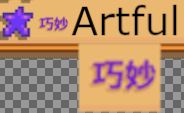

# Paste

The paste can be found unformatted at [this link](/routes/Pastes/GlitchedTruePerfUnformatted2026v3.txt), and can be found formatted at [this link](/routes/Pastes/GlitchedTruePerf2026v3.md).

# Route
## Overview
The main mechanic is to repeatedly read the mail to get different effects applied, each of which help towards specific aspects of perfection. The main limiters are Fishing, Eradication, and Friendship. Note that you never need to worry about garbage items entering the inventory, as they will all be cleared upon the next read.

## File Creation
You need to be in Chinese, select Meadowlands Farm, Legacy RNG, and Male character. Copy paste the shorter name into the player's name, and use whatever you want for farm name / favorite. Don't skip the intro cutscene, and watch it until Robin first says the player's name (at which point you skip)
## Day 1
Leave the house, moving the bed closer to the door as you do. Immediately read your first mail.
### Read 1
Your inventory contains the following items
 - Magic Rock Candy and Triple Shot Espresso: Immediately Eat
 - Napalm Ring: Immediately Equip
 - 99 Mega Bombs: Place 1 row of bombs to clear the front yard for obelisks and pond later
 - Beach Warp: Use after placing bombs
Run to Marnie (through the opened community shortcut) and buy the first chicken. Note that the paste begins with a newline, so you don't need to delete the randomly generated chicken name.
### Chicken 1
This chicken starts Accelerated Kent PTSD. You can find more information on it at [the glitch info](/glitches/Y1KentFriendship.md) page on it, but the basics are:
 - If you are doing Move Breaking (consistent, requires using 3420 [79]'s), you need to press OK *before* the farmer reaches the fridge. Spam click OK until they're all gone. Then, walk up to the move trigger spot (either above the hallway, 2 below the fridge, 1 below the fridge, or the fridge, depending on how late you pressed OK).
 - If you are doing Regular (inconsistent, slightly quicker, requires using less [79]'s [I use 2268; if you click faster you might need more, if you click slower you might need less]), you need to press OK *after* the farmer reaches the fridge. Spam click OK until they're all gone. If you go past the desired dialogue box, remove [79] in units of 36, and if you end early add [79]'s in the same batch size.

In both cases, you then need to do the central loop.
 - When Kent asks the question, click the middle option. This will give +50 (*1.1 from friendship101) friendship points, and thus you just need to do this 46 times.
 - You can read the Book Of Stars while you have control; so inputs are holding right click (or X) and spamming click. Make sure to not be interacting with a furniture item (like the fridge)
 - Once you've reached 10 hearts, you can either Beach Warp out or skip cutscene (the button exists it's just invisible) and run out.

From there, head to the Wizard (and read the Book Of Stars that weren't gotten to yet). Gift the Wizard 4 stardrop teas, and then go build Obelisks + Golden Clock. Each obelisk is useful, so it's recommended to use a layout where you have easy access to all 4 from the mail. You can use Left to access Golden Clock (1 click) and Island Obelisk (2 clicks) slightly faster.

Once the Obelisks have been built, run to the Wizard's basement. There, you can find the golden rename statue. Grab Name 2, and paste that at the end of your name (no need to delete anything). Then, transition from Male to Female. If the paste was successful, a chat message will pop up complaining about the item ids. Finally, run to the pentagram and use the weapon to kill the kids.

Beach warp, and run to Marnie again. Note again that the paste begins with a newline, so you don't need to delete the randomly generated chicken name.

### Chicken 2
This chicken warps you into the sewers, with a cutscene. Wait until the Dwarf dialogue box appears, and then skip. Say hi to Krobus (you can't gift until you talk once, so there's no risk with what item you hold [unless it's a warp totem. I recommend switching to slot 1 beforehand due to this]). Run out of the sewers, and go to Pierre's to get 2 backpack upgrades. Gift Pierre a Stardrop Tea (do not talk to him - he says your name).

Use the Island Warp Totem to run to Leo's Hut. Skip the cutscene Immediately, and use the Mountain Warp (this is enough to meet Leo). Run to Robin's, and create a Fish Pond. Return Scepter back home. Equip the Golden Spur, and place the Junimo Chest with 999 UndoButtons somewhere semi-convenient but out of the way.

### Read 2
This read empties your inventory and gives you items to ship. Ship them all (you can drag with left+right click, or shift+right click, to do it quickly).

### Read 3, 4, 5, 6
More shipping. Ship them all.

### Read 7
This gives Crafting ingredients. Place down the Cookout Kit and the Workbench, and use the workbench to start crafting. Craft the entirety of Page 1 and Page 2.

### Read 8
Craft most of Page 3 - you can't craft the forage seeds.

### Read 9
Craft Page 4.

### Read 10
Craft Page 5.

### Read 11
Craft the forage seeds (on Page 3) and Page 6.

### Read 12
This gives Cooking ingredients. Cook the entirety of rows 1 and 2.

### Read 13
Cook rows 3, 4, and all but 1 of 5.

### Read 14
Do not cook Miner's Treat again (you are capable of it). Cook the last item on row 5, all of row 6, and all but 2 of row 7.

### Read 15
Cook all remaining items. Place the Mini-Forge.

### Read 16
Equip Deluxe Bait and Dressed Spinners onto the Advanced Iridium Rod. Place the Explosive Ammo on the Galaxy Slingshot. Combine your rings into Napalm+Iridium Bands. Optionally, enchant your weapons. That would be 3 rubies on the Hammer, 3 aquamarines on the Dagger, and Artful on both. The jury is still out as to if it is worth it; it depends on your weapon use. If you do not use the rubies or aquamarines, they will be removed in Read 17. See below for what the enchant looks like in Chinese.

Finally, go to sleep (swap to row 2 [fishing rod row]). Select the Left lvl 5 options each time (this gives the Brute combat profession for increased bomb damage). 

## Combat

Eat buffs, and swap to row 1 [combat row] (it's important to be on this row when reading the mail). Run out of your home, and read the mail (read 17). This cleans up all of the extra items, and leaves your inventory as following:

 - Row 1: Combat.
 - - Iridium Pickaxe, for the rare rocks it's faster to break than to bomb or slingshot.
 - - Watering Can, for the volcano. Every mail, this can gets deleted and re-given to refill.
 - - Staircase
 - - Infinity Gavel, for rare use. Occasionally, use to kill enemies rather than wait for bombs to explode.
 - - Iridium Needle, for rare use. More effective than the Gavel on Royal Serpents, due to the reduced knockback.
 - - 5 stacks of Mega Bombs. Always avoid allowing a stack to empty, and swap to another.
 - - Galaxy Slingshot, filled with Explosive Ammo. Use to aggro far away Magma Sprites, or to break rocks in the Volcano.
 - - Return Scepter
 - Row 2: Fishing + Warps.
 - - Fishing Rod, for the Jelly fishing performed on Day 3.
 - - Magic Rock Candy and Triple Shot Expresso, to consume every morning (and often refill on TSE partway through the day).
 - - Staircase, to leave floor 20 Immediately after fishing on Day 3.
 - - Mountain Warp, to leave the Volcano with on Days 2 & 3.
 - - Desert Warp, to leave the Volcano with on Day 4.
 - - 5 stacks of Mega Bombs.
 - - Return Scepter
 - Row 3: Extra Inventory
 - - 4 stacks of Mega Bombs, to keep the inventory slots full to avoid picking up garbage.
 - - 4 stacks of different quality Stonefish, to ensure you can pick one up if you catch it when fishing.
 - - 4 stacks of different quality Sunfish, to ensure you can pick one up if you catch it while fishing.

Each day will have the same approximate schedule; read your mail, use the Island Obelisk to kill Magma Sprites (go to floor 9, unless a floor is really slow then it might be fine to leave early), then warp to the mines and kill some monsters on infested floors (with potential extra mail reads).

### Spring 2nd, Read 17* (Dust Sprites + Skeletons)
As stated, after reading your mail go to Volcano first. Once you're done, use a Mountain Warp. Run to the Mines, and use the elevator to go to floor 45, and staircase down to 49. If the floor is only grubs, warp home and read your mail again (and use the obelisk to go back). Use bombs to kill Dust Sprites (and grubs; they will die long before the sprites). Use your instincts to know whether killing Dust Sprites on 45,46,47, and 48 are worth.

Once Dust Sprites are eradicated, go to floor 75 and kill Skeletons on floors 75->79. Once they're eradicated, warp home and sleep.

It is crucially important that you *only* read your mail an extra time on this day if you get bad RNG on floor 49. This is used to ensure you only get good infested floors in the future.

### Spring 3rd, Read 18 (Duggies)

As normal, go to Volcano first. Once you're done, Mountain Warp and run to floor 20. Start fishing; the first fish will be the tutorial fish and be either a Stonefish or a Sunfish. Catch it, and let it into your inventory. Then, fish for Cave Jelly and White Algae (and note if you get Green Algae). If you catch an Algae before the Jelly, animation cancel when the Algae is above your head (big white box, first catch text above) to avoid incrementing PreciseFishCaught (ensures you have the right rng to be capable of catching jellies).

Staircase down to floor 23, and kill Rock Crabs and Duggies. Optionally, do an extra loop or two of 23 to kill more rock crabs after finishing Duggies.

### Spring 3rd, Read 19 (Void Spirites + Rock Crabs)

Then, Return Scepter home, and read your mail. This ensures you have good Jelly RNG again, and makes floor 96 infested. Go back to the mountain, and catch River Jelly (in the mountain lake) and Green Algae (if you didn't get it in the cave). Then, go to 96 and eradicate Void Spirits and Rock Crabs. Void Spirites will be eradicated before Rock Crabs. Once both are eradicated, warp home and sleep.

### Spring 4th, Read 20* (Pepper Rexes)

As normal, go to Volcano first. Once you're done, Desert Warp and meet Sandy (it is safe to just talk to her). If it's not 9am yet, remember to do that later instead. Run to the Skull Caverns, and go to floor 7. It's recommended to bomb any particularly dense Mummy floors (and potentially Serpent floors). If floor 7 is infested but *not* Pepper Rex floor, warp home and read your mail and go back. It might be a mummy floor, or a layout that can't be infested, in which case you should simply leave and re-enter. Once Pepper Rex's are eradicated, warp home and read your mail.

### Spring 4th, Read 21 (Slimes + Serpents + Mummy)
Warp back, and if you didn't meet Sandy earlier do that now. Loop floor 1 until Slimes and Serpents are eradicated. 

### Spring 5th, Read 21*
(The code doesn't increment the mail read variable so it's still read 21 according to the code.)

Warp to Island, and eradicate Magma Spirits. If they aren't eradicated yet, also eradicate them on Spring 6th.

## Spring 6th -> 11th
Sleep!

## Fishing

### Spring 12th, Read 22

Switch to the Fishing row. Read your mail. This creates the following inventory

- Row 1: Fishing Rod, Chair, 10 fish
- Row 2: Fishing Rod, 11 fish
- Row 3: Fishing Rod, 11 fish

Perform [fish pond fishing](/glitches/FishPondFishing.md). In summary, place the chair facing the top row of the fish pond, get in, get out, and fish into the pond. Once a fish is caught, you can animation cancel when the fish is fully caught (held in the white box above your head) to delete it or allow it into your inventory and don't forget. Empty the pond, and switch to the next fish. All left over fish will get trashed by the paste, so as long as it doesn't lead to catching fish multiple times it's fine. Once a row is complete, swap to the next row.

Once every fish is caught, sleep.

### Spring 13th, Read 23

Read your mail, which refills the inventory with fish. Get in and out of the chair, and catch all the remaining fish.

### Spring 13th, Read 24

This mail removes the 2 extra rods, and gives you a (useless) Mountain Warp, some Magic Rock Candy and Triple Shot Espresso (consume?), some Tent Kits, a Return Scepter, and a stack of (BC)29 OBELISK. Use the beach warp totem to go to the beach, and catch Sea Jelly and Seaweed. Note that you have good RNG for Sea Jelly, and you can do the same animation cancelling timing to catch Seaweed without incrementing PreciseFishCaught. If you mess up, you can warp home and read mail to fix the RNG.

## Friendship + Summit
### After Sea Jelly
After catching Sea Jelly and Seaweed, run to the Egg Festival. Meet everybody (Pierre+Robin+Lewis are already met, and depending on timings it's possible you met Jodi if you didn't do Move Breaking Accelerated Kent PTSD). 

### Spring 14th, Read 25
Leave, and read your mail. This will give you 8/10 hearts with everybody, and so you can now Immediately warp to the mountain and place a tent kit just below the summit.

Because perfection only gets updated overnight (and we injected the boulder away so we can run up to the summit despite that), we sleep. Running up would lead to Mr. Qi. Killing You.

### Spring 14th
Hold up and enter the summit!!! Time ends upon on the Perfection cutscene fade in on mountain. Receive bonus points if you do any of

a) Click through the entire name in the cutscene (about 8 minutes, Lewis says it twice)

b) Wait for 300 Doves to show up

c) Place down the OBELISKs (1 on 3 of the 4 sides, leave a gap) and stand next to them until the game crashes (1/20k every frame. can also spawn a slime or a Shadow Girl. still occurs when paused). (BC)29 is my favorite item in the game.