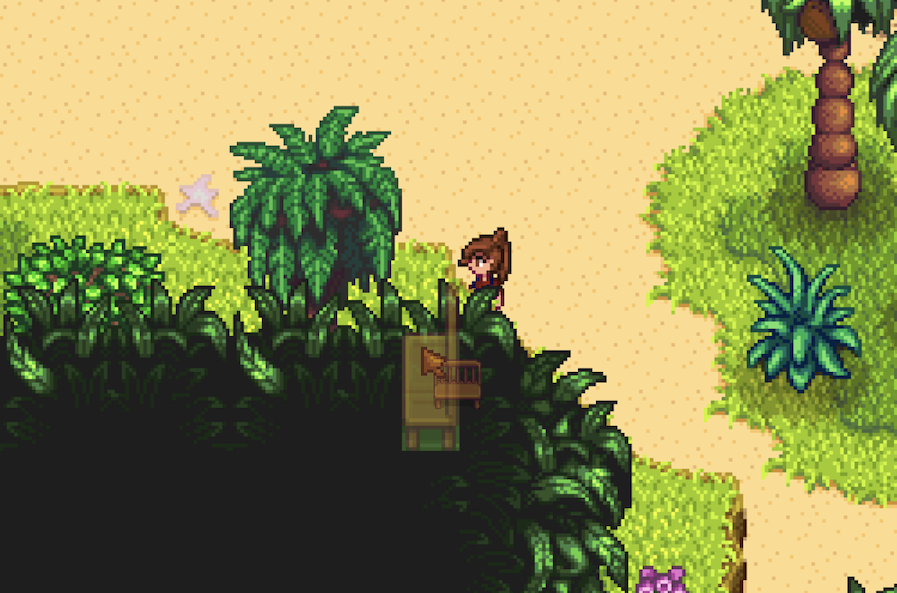
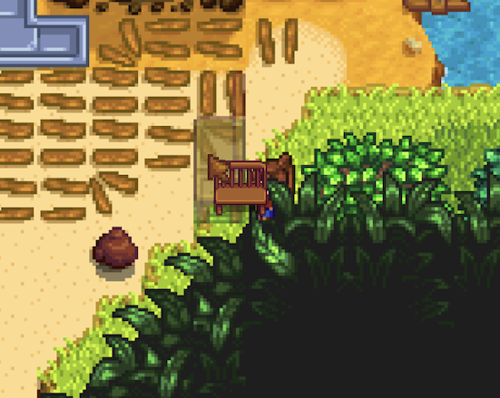
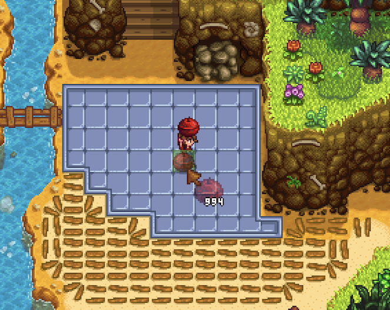

# Paste
Can be found at [this link](/routes/Pastes/NDEWaiverful2026v1.txt)

# Route

### File Creation
Change language to Chinese. In file creation, set the player name to `%farm%farm[73]`, the farm name to `%favorite%favorite`, and the favourite item to `%pet%pet%pet[74]`. Choose the meadowlands farm, and make sure to *not* skip the intro cutscene.

### Day 0
Spam escape to skip the first sections of the intro cutscene. The moment Robin says your name, skip the rest of the cutscene
### Day 1
Run outside, moving your bed closer to the door as you do. Sell the 4 prismatic shards that are in your inventory. Immidiately run back to sleep
### Day 2-4
Sleep
### Day 5
Go outside, encountering Marnie. Spam through dialogue until you have the option to name your pet. Name the pet `[857][857][857]`. Sell your newly obtained 4 prismatic shards, and immidiately go back to sleep.
### Day 6
Grab your bench, and go outside. Place the bench next to your shipping bin. Clear everything that could be in the way between your front doorstep and the coop (including the fences). Sell your two starting chickens. Chop down enough wood for a chest, and put everything but your scythe in it. Now, run to Marnie and wait till 9am.

Go to Marnie and start buying chickens. Your first four chickens should be named `[279][253][253]@`, `[Book_Speed]@@`, `[(BC)238][(BC)238]`, and `[(T)ReturnScepter]`. This will give you a Magic Rock Candy, 2 Triple Shot Espressos, The Way Of The Wind, 2 Mini-Obelisks, a Return Scepter, and some Tiger Slime Eggs/Prismatic Shards. 

Consume the MRC, a Triple Shot Expresso, read WOTW, and run up to your farm. Place a Mini-Obelisk just above the transition, and use the Return Scepter. Run to your coop, sell all 4 chickens, and place a Mini-Obelisk just outside of your coop. Use your Mini-Obelisk to warp to the bottom, and run back to Marnie.

Purchase another 4 chickens, named `[Book_Speed2]@`, `@#Farm_Eternal}`, `@@@@#FizzIntro}`, and `@@@@@@@@@`. This will give you Way Of The Wind 2 along with a lot of Tiger Slime Eggs and Prismatic Shards. Warp back home, and sell.

Now, do 3 more rounds of 4 chickens, each named `@@@@@@@@@`. Note that because you can't have duplicate names, you will need to manually type an additional small character after 3 of these 4 names. Working characters include `li,. |f!()-\[]{};:'`, so take your pick.

Purchase 2 more chickens, and then warp home. You should have approximately 576 prismatic shards and 5 stacks + 192 tiger slime eggs at this point. Sell all the shards and eggs, and pick up your bench as you run to the coop to sell these chickens.

Go to Marnie for the final time, and name them `[288][689][279]`, `[TentKit][TentKit]`, `#gotMaxStamina}`, and `#$v 6497421 false ` (important, there is a space after false). This will give you a Mega Bomb, a Warp Totem: Mountain, a Magic Rock Candy, 2 Tent Kits, and will put you in an Island North Cutscene.

Skip this cutscene immidiately, and run down to the bridge. Put your bench out of bounds, and sit on it to get out of bounds. Place the bench again to re-enter bounds. There are multiple working spots, but here are two.

 

Place the Mega Bomb (valid tiles shown below), and skip the cutscene. Put your tent down, and go to sleep.

### Day 7

Run into the cave, and encounter Fizz. He will sell you 85 perfection waivers, so purchase them as fast as possible. After this, use the Warp Totem: Mountain and go to sleep.

### Day 8

Eat your buffs, and run down to the bottom transition. Use the bench and the scythe to go OOB, and run OOB up to the collapsed railroad entrance and enter it from the wrong side. Run all the way up to the summit, and complete the speedrun. 
