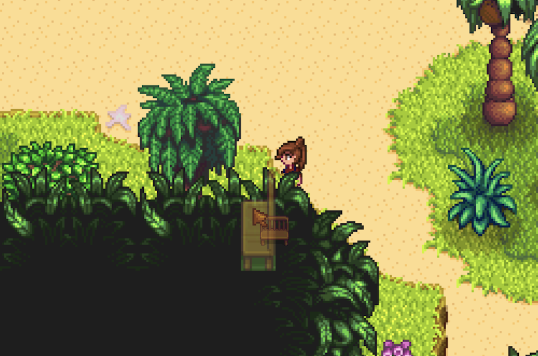
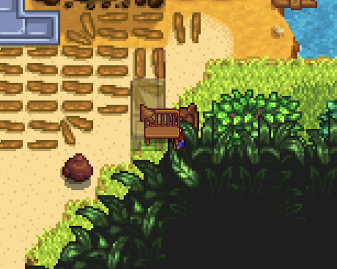
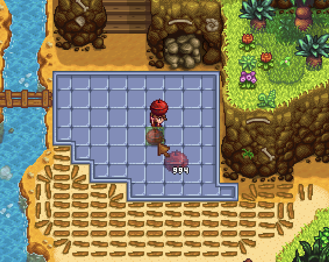

# Paste
Can be found at [this link](/routes/Pastes/NDEWaiverful.txt)

# Route

### File Creation
Change language to Chinese. Paste in the Player, Favorite, and Farm names. Choose the meadowlands farm, and make sure to *not* skip the intro cutscene.

### Day 0
Spam escape to skip the first sections of the intro cutscene. The moment Robin says your name, skip the rest of the cutscene
### Day 1
Run outside, moving your bed closer to the door as you do. Sell the 4 Magic Rock Candies that are in your inventory. Immidiately run back to sleep
### Day 2-4
Sleep
### Day 5
Go outside, encountering Marnie. Spam through dialogue until you have the option to name your pet. Name the pet, and skip the instant you've pressed Enter to save the name. Go back to sleep.
### Day 6
Save and quit, and change language to Japanese (have a smaller game for quicker snq). Load back in with your new language. Grab your bench along with 4 other furniture (for a total of 5 furniture), and go outside. Eat one of your 4 Magic Rock Candies. Drop all items next to the shipping bin; importantly, the Magic Rock Candies need to be enough outside pickup range to enable shipping an item without picking them up.

Clear everything that could be in the way between your front doorstep and the coop (including the fences). Sell your two starting chickens. Chop down enough wood for a chest, and put everything but your scythe in it. Now, run to Marnie and wait till 9am.

Go to Marnie and start buying chickens. After buying 4 chickens, drink the Triple Shot Expresso, and run up to the farm. Place the Mini-Obelisk at the bottom of the transition, and Return Scepter to the farm. Run to the Coop, sell 4 chickens, and use the second Mini-Obelisk to warp back.

Buy another 4 chickens. The 4th chicken will be the start of the 14/15 @ pastes. To minimize alt-tabbing, the paste has 14@'s. To type 15@'s, you paste twice. Return scepter, sell 4 chickens, Mini Obelisk, back to Marnie.

Buy another 4 chickens. 1 of these 4 must be a 15 @ (so paste twice), and for 2 of the other 4 you need to type an extra disambiguating character (like v) - any character works, as long as you don't pick the same one twice. Return scepter, sell, return.

Buy another 4 chickens, with the same instructions as above. Return Scepter home, and sell the Magic Rock Candies and all of the Tiger Slime Eggs. Pick up the other items, and use the Island Warp Totem.

Run to the right, and go to the Tent Kits in Island East. The inventory is full, allowing for quick obtaining of the tent kits. Run up to Leo's Hut, instant skip the cutscene, then give the parrot 1 Golden Walnut and instant skip. Use the Island Warp totem.

Run up, and head to the bridge. Put your bench out of bounds, and sit on it to get out of bounds. Place the bench again to re-enter bounds, and pick it back up. There are multiple working spots, but here are two.

 

Place the Mega Bomb (valid tiles shown below), and skip the cutscene. Put your tent down, and go to sleep.

### Day 7

Run into the cave, and encounter Fizz. He will sell you 85 perfection waivers, so purchase them as fast as possible. After this, use the Warp Totem: Mountain and go to sleep.

### Day 8

Eat your buff, and run over to the left transition. Use the bench and the scythe to go OOB (see [the glitch page](/glitches/Miscellaneous%20Glitches.md#weapon-out-of-bounds)), and run OOB up to the collapsed railroad entrance and enter it from the wrong side. Run all the way up to the summit, and complete the speedrun. 
